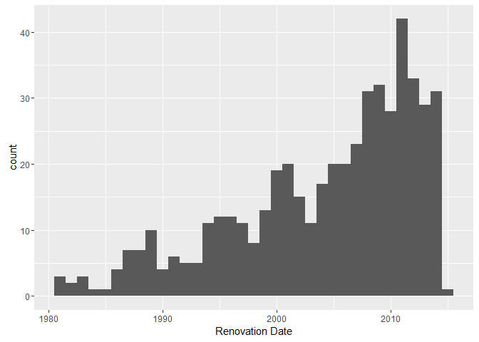
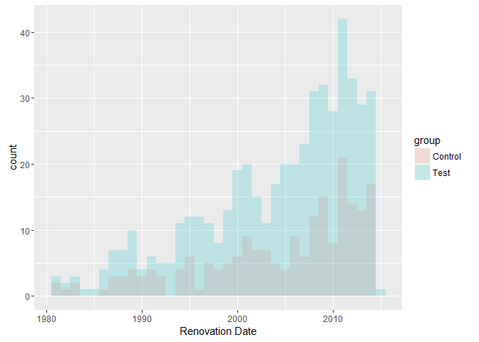

# Library Investment Examination
Mike Silva  
July 12, 2016  


## Introduction  

A [recent local new paper article](http://www.democratandchronicle.com/story/news/2016/05/31/libraries-thriving-electronic-age/83511222/) chronicled the role libraries are playing today.  They highlight some local libraries that have undergone major renovations.  In the article they claim:

> The surge in popularity mirrors what other communities have seen. When they invest in libraries, the number of people using them goes up.

The claim seemed to rely on anecdotal evidence, so I determined to examine this using data.  

## Methodology

In order to evaluate the accuracy of this statement, I will start by defining the investment in a library as a renovation.  This is consistent with the storyline.  I will compare usage before and after the investment.  If the claim is true, then the usage after should be higher than before.  I will define usage in terms of visits and circulations of books.

I will evaluate the difference in the mean before and after the renovation.  I will test for these differences over a variety of time windows (i.e. 10 years to 1 year) to see how long the effect lasts (if it exists at all).

### Data Used
New York State Education Department (NYSED) puts together an annual report for public and association libraries.  This data is made available to the general public through Bibliostat Connect.  You can gain access by following the directions on [this page](http://www.nysl.nysed.gov/libdev/libs/index.html#Statistics).  The visits and circulation data is available through this source and spans 1991 to 2014.

The annual report does ask the year of the last major renovation.  For some reason or another, this data is not available through Bibliostat Connect.  We requested this data for a research project at work directly from NYSED and received the latest (2014) data.

#### Exploratory Analysis & Data Cleaning

I am hosting all data on my Google Drive.  First I will load the data into the R evironment.


```r
# Short URL to https://googledrive.com/host/0B9jKAdYAFCl3bk9jODNteXhYbFk/renovations.csv
renovations <- read.csv('https://goo.gl/zxAMeH', na.strings = 'N/A', skip = 3, stringsAsFactors = FALSE)
# Short URL to https://googledrive.com/host/0B9jKAdYAFCl3bk9jODNteXhYbFk/visits_timeseries.csv
visits <- read.csv('https://goo.gl/CPXTJo', na.strings = 'N/A', stringsAsFactors = FALSE)
# Short URL to https://googledrive.com/host/0B9jKAdYAFCl3bk9jODNteXhYbFk/book_circulation_timeseries.csv
book_circulation <- read.csv('https://goo.gl/fyybwi', na.strings = 'N/A', stringsAsFactors = FALSE)
```

There are 1071 records in the renovations data frame.  Some of them are blank lines and a source line.  I will remove them from the data set.


```r
library(dplyr)
renovations <- renovations %>%
  filter(ifelse(NAME=='',0,1)==1)
```

We have 1064 libraries left in the data frame.  Since we will be joining the renovations to the visits and circulation data, let's take a look at the names:


```r
library(pander)
# Are they unique?
renovations %>%
  group_by(X) %>%
  select(X) %>%
  rename(Library = X) %>%
  summarise(Count=n()) %>%
  filter(Count>1) %>%
  pandoc.table(.)
```


--------------------------------------
           Library              Count 
------------------------------ -------
    Albany Public Library         7   

    Amherst Public Library        4   

   Brooklyn Public Library       64   

Buffalo and Erie County Public    9   
           Library                    

     Canton Free Library          3   

   Catskill Public Library        2   

    Chatham Public Library        2   

  Cheektowaga Public Library      2   

    Chemung County Library        6   
           District                   

      Great Neck Library          4   

 Greater Poughkeepsie Library     2   
           District                   

    Greece Public Library         2   

 Half Hollow Hills Community      2   
        Public Library                

    Hamburg Public Library        2   

   Harrison Public Library        2   

  Haverstraw Kings Daughters      2   
        Public Library                

   Highland Public Library        2   

  Huntington Public Library       2   

  Irondequoit Public Library      2   

    Jordan Bramley Library        2   

  Long Beach Public Library       2   

Mary E. Seymour Memorial Free     2   
           Library                    

  Massapequa Public Library       2   

    Massena Public Library        2   

Middle Country Public Library     2   

Mount Pleasant Public Library     2   

 New Rochelle Public Library      2   

 New York Public Library, The    85   
       Branch Libraries               

    Newburgh Free Library         2   

 Niagara Falls Public Library     2   

 North Castle Public Library      2   

   Northern Onondaga Public       3   
           Library                    

   Northport Public Library       2   

Onondaga County Public Library    9   

   Oxford Memorial Library        2   

      Patterson Library           2   

 Port Jefferson Free Library      2   

Queens Borough Public Library    62   

   Rochester Public Library      11   

    Rye Free Reading Room         2   

  Schenectady County Public       9   
           Library                    

   Scottsville Free Library       2   

  Sea Cliff Village Library       2   

    Seneca Nation Library         2   

Sidney Memorial Public Library    3   

  Smithtown Special Library       4   
           District                   

    Sullivan Free Library         2   

   Town Of Tonawanda Public       2   
           Library                    

     Troy Public Library          2   

   Westbury Memorial Public       2   
           Library                    

   Western Sullivan Public        3   
           Library                    

Woman's Round Lake Improvement    2   
           Society                    

   Woodbury Public Library        2   

    Yonkers Public Library        3   
--------------------------------------

There are 54 libraries with more than one renovation record.  Since the circulation and visitation data is aggregated, we are going to have to remove them from the data set.  This is problematic because they represent the libraries for the major population centers.


```r
renovations <- renovations %>%
  group_by(X) %>%
  select(X) %>%
  summarise(Count=n()) %>%
  filter(Count==1) %>%
  select(-Count) %>%
  merge(renovations)
```

We now have 701 libraries left in the data frame.  Let's take a look at the libraries renovations dates:


```r
pandoc.table(summary(renovations$RENOVDATE))
```


--------------------------------------------------------
 Min.   1st Qu.   Median   Mean   3rd Qu.   Max.   NA's 
------ --------- -------- ------ --------- ------ ------
  0      1997      2006    1995    2011     2015   172  
--------------------------------------------------------

The usage data only spans 1991 to 2014.  As noted in the methodology section, I will be testing for the effects using a 10 year to one year time horizion.  Consequently some libraries will be excluded because the renovation didn't occur in the time window.  As the time window shrinks the number of libraries included in the analysis will increase.  Since the usage data starts in 1991, we are going to treat all libraries with libraries with renovations before 1980 as if there was no renovation at all.


```r
renovations <- renovations %>%
  mutate(RENOVDATE = ifelse(RENOVDATE<=1980,NA,RENOVDATE))
```

Now let's visualize the renovation dates:


```r
library(ggplot2)
ggplot(renovations, aes(x=RENOVDATE)) + geom_histogram(binwidth = 1) + xlab('Renovation Date')
```

<!-- -->

There are 204 libraries that don't have a renovation date.  We can use them as a control group.


```r
renovations <- renovations %>%
  mutate(group = ifelse(is.na(RENOVDATE), 'Control','Test'))
```

To use the control group we need to assign a renovation date.  This will be done by selecting a date with a probability proportional to the test group.


```r
renovation_dates <- renovations %>%
  filter(group == 'Test')

renovation_dates <- renovation_dates$RENOVDATE

# Get the count of N/A's
control_observations <- renovations %>%
  filter(group == 'Control') %>%
  nrow(.)

# Make it reproducable
set.seed(42)
control_renovation_dates <- sample(renovation_dates, control_observations)

# Set the renovation date
renovations[is.na(renovations$RENOVDATE),]$RENOVDATE <- control_renovation_dates
```

Let's confirm that this was properly done by visualizing the results:


```r
ggplot(renovations, aes(x=RENOVDATE, fill=group)) + geom_histogram(binwidth = 1, position="identity", alpha=0.2) + xlab('Renovation Date')
```

<!-- -->

Let's join the renovation data with the useage data:


```r
visits <- renovations %>%
  select(X, RENOVDATE, group) %>%
  left_join(., visits, by=c("X"="Libraries")) %>%
  rename(Libraries = X)

book_circulation <- renovations %>%
  select(X, RENOVDATE, group) %>%
  left_join(., book_circulation, by=c("X"="Libraries")) %>%
  rename(Libraries = X)
```

Now we need to transform the tables from wide to long:


```r
library(tidyr)
wide_to_long <- function(df){
  gather(df, year, measurement, X1991:X2014) %>%
  mutate(year = as.numeric(substr(year,2,5))) %>%
  mutate(measurement = as.numeric(gsub(',', '', measurement)))  
}

visits <- wide_to_long(visits)
book_circulation <- wide_to_long(book_circulation)
```

Now we need to identify if the data is before or after the renovation and by how many years:


```r
before_or_after <- function(df){
  df %>%
  mutate(n_years = abs(RENOVDATE - year)) %>%
  mutate(period = ifelse(year < RENOVDATE, 'Before', 'After')) %>%
  mutate(period = ifelse(year == RENOVDATE, NA, period))
}

visits <- before_or_after(visits)
book_circulation <- before_or_after(book_circulation)
```

We are going to drop data from the year that the renovation occurs, and all observations missing a measurement:


```r
drop_year_zero_and_nas <- function(df){
  df %>%
  filter(n_years > 0) %>%
  filter(complete.cases(.))
}

visits <- drop_year_zero_and_nas(visits)
book_circulation <- drop_year_zero_and_nas(book_circulation)
```

So with all these transformations we can take our first look at the data:


```r
visits %>%
  group_by(group, period) %>%
  summarise(average = mean(measurement), observations = n()) %>%
  pander(.)
```


-----------------------------------------
 group   period   average   observations 
------- -------- --------- --------------
Control  After   28533.02       1541     

Control  Before  35178.09       2243     

 Test    After   87135.50       3803     

 Test    Before  87214.73       5223     
-----------------------------------------

```r
book_circulation %>%
  group_by(group, period) %>%
  summarise(average = mean(measurement), observations = n()) %>%
  pander(.)
```


-----------------------------------------
 group   period   average   observations 
------- -------- --------- --------------
Control  After   44945.18       1541     

Control  Before  53104.17       2243     

 Test    After   115367.54      3803     

 Test    Before  119578.77      5223     
-----------------------------------------

There is no discernable difference between the average number of visitors before a renovation occurs and after, for those libraries that have a renovation.  There is also no increase in book circulation.  In fact it declines after the renovation.

This causes me to pause and think we need to understand the general trend in visits and circulation because it appears that they are both declining.


## Are the Two Groups Different?

First we will examine the two groups to see if there is a meaningful difference between the two.  If there are not then we can conclude that the journalist's claims are unfounded.


```r
get_data <- function(df, n_years_threshold){
  df <- df %>%
    filter(n_years <= n_years_threshold) %>%
    group_by(Libraries, group, period) %>%
    summarise(measurement = mean(measurement), count=n()) %>%
    filter(measurement>0) %>%
    filter(count == n_years_threshold) %>%
    select(-count) %>%
    spread(period, measurement) %>%
    mutate(Difference = After-Before)
  df[complete.cases(df),]
}

are_the_groups_different <- function (df){
  for(i in 1:10){
    data <- get_data(df,i)
    # Regression Model
    model <- lm(Difference~group, data=data)
    message(paste(i,'Year Window'))
    print(summary(model))
  }
}
```

### Book Circulation

```r
are_the_groups_different(book_circulation)
```

```
1 Year Window
```

```

Call:
lm(formula = Difference ~ group, data = data)

Residuals:
    Min      1Q  Median      3Q     Max 
-179168   -6692   -3055     577  319222 

Coefficients:
            Estimate Std. Error t value Pr(>|t|)
(Intercept)     2231       3013   0.741    0.459
groupTest       2666       3577   0.745    0.456

Residual standard error: 34880 on 459 degrees of freedom
Multiple R-squared:  0.001209,	Adjusted R-squared:  -0.0009674 
F-statistic: 0.5554 on 1 and 459 DF,  p-value: 0.4565
```

```
2 Year Window
```

```

Call:
lm(formula = Difference ~ group, data = data)

Residuals:
    Min      1Q  Median      3Q     Max 
-225605   -8191   -4459    1269  257263 

Coefficients:
            Estimate Std. Error t value Pr(>|t|)
(Intercept)     3813       3146   1.212    0.226
groupTest       2405       3727   0.645    0.519

Residual standard error: 34610 on 419 degrees of freedom
Multiple R-squared:  0.0009931,	Adjusted R-squared:  -0.001391 
F-statistic: 0.4165 on 1 and 419 DF,  p-value: 0.519
```

```
3 Year Window
```

```

Call:
lm(formula = Difference ~ group, data = data)

Residuals:
    Min      1Q  Median      3Q     Max 
-158157   -9479   -5157    1578  271344 

Coefficients:
            Estimate Std. Error t value Pr(>|t|)
(Intercept)     4451       3450   1.290    0.198
groupTest       3762       4091   0.919    0.358

Residual standard error: 35860 on 372 degrees of freedom
Multiple R-squared:  0.002268,	Adjusted R-squared:  -0.0004145 
F-statistic: 0.8454 on 1 and 372 DF,  p-value: 0.3584
```

```
4 Year Window
```

```

Call:
lm(formula = Difference ~ group, data = data)

Residuals:
    Min      1Q  Median      3Q     Max 
-137385  -12873   -8199     721  288954 

Coefficients:
            Estimate Std. Error t value Pr(>|t|)
(Intercept)     6946       4283   1.622    0.106
groupTest       4952       5053   0.980    0.328

Residual standard error: 39950 on 307 degrees of freedom
Multiple R-squared:  0.003119,	Adjusted R-squared:  -0.0001277 
F-statistic: 0.9607 on 1 and 307 DF,  p-value: 0.3278
```

```
5 Year Window
```

```

Call:
lm(formula = Difference ~ group, data = data)

Residuals:
    Min      1Q  Median      3Q     Max 
-114632  -15452   -9778     883  299210 

Coefficients:
            Estimate Std. Error t value Pr(>|t|)  
(Intercept)     9298       4884   1.904    0.058 .
groupTest       4982       5755   0.866    0.387  
---
Signif. codes:  0 '***' 0.001 '**' 0.01 '*' 0.05 '.' 0.1 ' ' 1

Residual standard error: 42300 on 266 degrees of freedom
Multiple R-squared:  0.00281,	Adjusted R-squared:  -0.000939 
F-statistic: 0.7495 on 1 and 266 DF,  p-value: 0.3874
```

```
6 Year Window
```

```

Call:
lm(formula = Difference ~ group, data = data)

Residuals:
    Min      1Q  Median      3Q     Max 
-107358  -19634  -11567   -1003  303204 

Coefficients:
            Estimate Std. Error t value Pr(>|t|)
(Intercept)     9830       5968   1.647    0.101
groupTest       8695       7045   1.234    0.218

Residual standard error: 46610 on 214 degrees of freedom
Multiple R-squared:  0.007067,	Adjusted R-squared:  0.002427 
F-statistic: 1.523 on 1 and 214 DF,  p-value: 0.2185
```

```
7 Year Window
```

```

Call:
lm(formula = Difference ~ group, data = data)

Residuals:
    Min      1Q  Median      3Q     Max 
-101341  -23111  -12047     183  306944 

Coefficients:
            Estimate Std. Error t value Pr(>|t|)
(Intercept)    11398       7388   1.543    0.125
groupTest      11435       8686   1.316    0.190

Residual standard error: 50650 on 168 degrees of freedom
Multiple R-squared:  0.01021,	Adjusted R-squared:  0.004319 
F-statistic: 1.733 on 1 and 168 DF,  p-value: 0.1898
```

```
8 Year Window
```

```

Call:
lm(formula = Difference ~ group, data = data)

Residuals:
    Min      1Q  Median      3Q     Max 
-107367  -28270  -13516   -1613  308601 

Coefficients:
            Estimate Std. Error t value Pr(>|t|)
(Intercept)    11408       9234   1.235    0.219
groupTest      16887      10965   1.540    0.126

Residual standard error: 59130 on 139 degrees of freedom
Multiple R-squared:  0.01678,	Adjusted R-squared:  0.009704 
F-statistic: 2.372 on 1 and 139 DF,  p-value: 0.1258
```

```
9 Year Window
```

```

Call:
lm(formula = Difference ~ group, data = data)

Residuals:
    Min      1Q  Median      3Q     Max 
-111174  -33139  -18256   -4111  331563 

Coefficients:
            Estimate Std. Error t value Pr(>|t|)
(Intercept)    13647      12801   1.066    0.289
groupTest      19140      15090   1.268    0.207

Residual standard error: 70110 on 105 degrees of freedom
Multiple R-squared:  0.01509,	Adjusted R-squared:  0.005711 
F-statistic: 1.609 on 1 and 105 DF,  p-value: 0.2075
```

```
10 Year Window
```

```

Call:
lm(formula = Difference ~ group, data = data)

Residuals:
   Min     1Q Median     3Q    Max 
-93266 -29727 -12203     59 356391 

Coefficients:
            Estimate Std. Error t value Pr(>|t|)
(Intercept)     6166      13659   0.451    0.653
groupTest      24600      16429   1.497    0.139

Residual standard error: 62590 on 66 degrees of freedom
Multiple R-squared:  0.03285,	Adjusted R-squared:  0.0182 
F-statistic: 2.242 on 1 and 66 DF,  p-value: 0.1391
```

### Visits

```r
are_the_groups_different(visits)
```

```
1 Year Window
```

```

Call:
lm(formula = Difference ~ group, data = data)

Residuals:
    Min      1Q  Median      3Q     Max 
-200928   -3728    -405    2787  246380 

Coefficients:
            Estimate Std. Error t value Pr(>|t|)
(Intercept)   -469.4     2917.2  -0.161    0.872
groupTest     2989.0     3474.8   0.860    0.390

Residual standard error: 33770 on 452 degrees of freedom
Multiple R-squared:  0.001634,	Adjusted R-squared:  -0.0005744 
F-statistic:  0.74 on 1 and 452 DF,  p-value: 0.3901
```

```
2 Year Window
```

```

Call:
lm(formula = Difference ~ group, data = data)

Residuals:
    Min      1Q  Median      3Q     Max 
-446736   -3709   -1187    3433  217170 

Coefficients:
            Estimate Std. Error t value Pr(>|t|)
(Intercept)     1652       3568   0.463    0.644
groupTest        884       4237   0.209    0.835

Residual standard error: 39250 on 414 degrees of freedom
Multiple R-squared:  0.0001051,	Adjusted R-squared:  -0.00231 
F-statistic: 0.04352 on 1 and 414 DF,  p-value: 0.8349
```

```
3 Year Window
```

```

Call:
lm(formula = Difference ~ group, data = data)

Residuals:
    Min      1Q  Median      3Q     Max 
-597271   -5821   -2257    3600  291836 

Coefficients:
            Estimate Std. Error t value Pr(>|t|)
(Intercept)     2684       4557   0.589    0.556
groupTest       2609       5406   0.483    0.630

Residual standard error: 47350 on 371 degrees of freedom
Multiple R-squared:  0.0006275,	Adjusted R-squared:  -0.002066 
F-statistic: 0.233 on 1 and 371 DF,  p-value: 0.6296
```

```
4 Year Window
```

```

Call:
lm(formula = Difference ~ group, data = data)

Residuals:
    Min      1Q  Median      3Q     Max 
-674604   -8856   -3809    5115  341752 

Coefficients:
            Estimate Std. Error t value Pr(>|t|)
(Intercept)     3956       5886   0.672    0.502
groupTest       4975       6944   0.716    0.474

Residual standard error: 54900 on 307 degrees of freedom
Multiple R-squared:  0.001669,	Adjusted R-squared:  -0.001583 
F-statistic: 0.5133 on 1 and 307 DF,  p-value: 0.4743
```

```
5 Year Window
```

```

Call:
lm(formula = Difference ~ group, data = data)

Residuals:
    Min      1Q  Median      3Q     Max 
-280109  -13919   -5371    2852  378674 

Coefficients:
            Estimate Std. Error t value Pr(>|t|)
(Intercept)     5054       4989   1.013    0.312
groupTest       9553       5879   1.625    0.105

Residual standard error: 43210 on 266 degrees of freedom
Multiple R-squared:  0.009829,	Adjusted R-squared:  0.006107 
F-statistic: 2.641 on 1 and 266 DF,  p-value: 0.1054
```

```
6 Year Window
```

```

Call:
lm(formula = Difference ~ group, data = data)

Residuals:
    Min      1Q  Median      3Q     Max 
-295303  -17379   -6146     311  403456 

Coefficients:
            Estimate Std. Error t value Pr(>|t|)  
(Intercept)     5533       6265   0.883   0.3781  
groupTest      12878       7396   1.741   0.0831 .
---
Signif. codes:  0 '***' 0.001 '**' 0.01 '*' 0.05 '.' 0.1 ' ' 1

Residual standard error: 48930 on 214 degrees of freedom
Multiple R-squared:  0.01397,	Adjusted R-squared:  0.009363 
F-statistic: 3.032 on 1 and 214 DF,  p-value: 0.08307
```

```
7 Year Window
```

```

Call:
lm(formula = Difference ~ group, data = data)

Residuals:
    Min      1Q  Median      3Q     Max 
-305957  -20453   -8668     683  422528 

Coefficients:
            Estimate Std. Error t value Pr(>|t|)
(Intercept)     9231       8268   1.116    0.266
groupTest      13418       9720   1.380    0.169

Residual standard error: 56680 on 168 degrees of freedom
Multiple R-squared:  0.01122,	Adjusted R-squared:  0.005331 
F-statistic: 1.906 on 1 and 168 DF,  p-value: 0.1693
```

```
8 Year Window
```

```

Call:
lm(formula = Difference ~ group, data = data)

Residuals:
    Min      1Q  Median      3Q     Max 
-304537  -24700  -10258   -2107  409033 

Coefficients:
            Estimate Std. Error t value Pr(>|t|)
(Intercept)    10745       9930   1.082    0.281
groupTest      16249      11791   1.378    0.170

Residual standard error: 63580 on 139 degrees of freedom
Multiple R-squared:  0.01348,	Adjusted R-squared:  0.006382 
F-statistic: 1.899 on 1 and 139 DF,  p-value: 0.1704
```

```
9 Year Window
```

```

Call:
lm(formula = Difference ~ group, data = data)

Residuals:
    Min      1Q  Median      3Q     Max 
-111245  -24185  -11024   -4555  404909 

Coefficients:
            Estimate Std. Error t value Pr(>|t|)
(Intercept)    11261      10449   1.078    0.284
groupTest      15674      12317   1.273    0.206

Residual standard error: 57230 on 105 degrees of freedom
Multiple R-squared:  0.01519,	Adjusted R-squared:  0.00581 
F-statistic: 1.619 on 1 and 105 DF,  p-value: 0.206
```

```
10 Year Window
```

```

Call:
lm(formula = Difference ~ group, data = data)

Residuals:
    Min      1Q  Median      3Q     Max 
-110014  -22922  -10205   -3721  401949 

Coefficients:
            Estimate Std. Error t value Pr(>|t|)
(Intercept)    11160      13597   0.821    0.415
groupTest      14560      16355   0.890    0.377

Residual standard error: 62310 on 66 degrees of freedom
Multiple R-squared:  0.01187,	Adjusted R-squared:  -0.003106 
F-statistic: 0.7925 on 1 and 66 DF,  p-value: 0.3766
```
